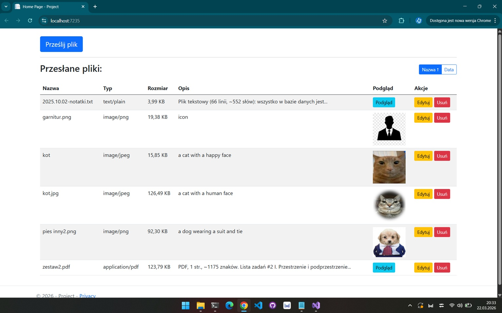
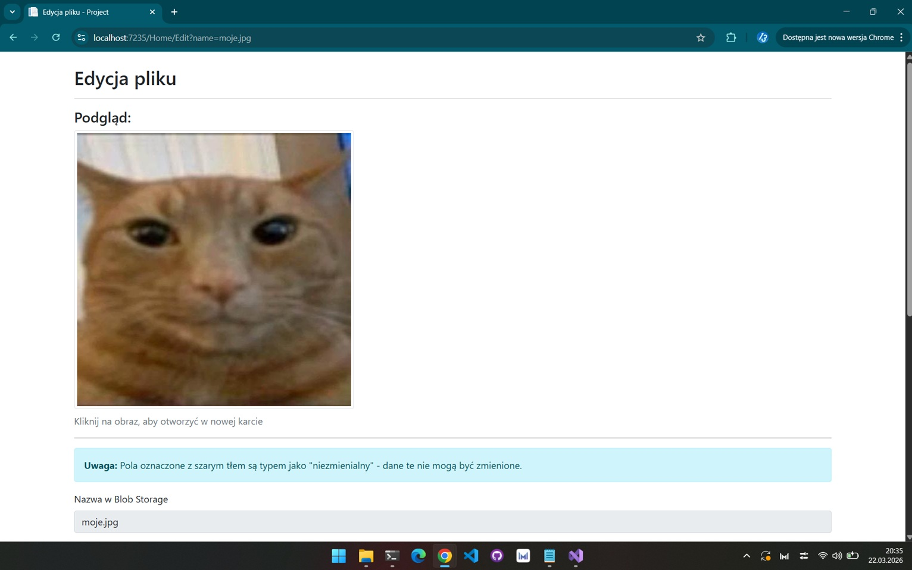
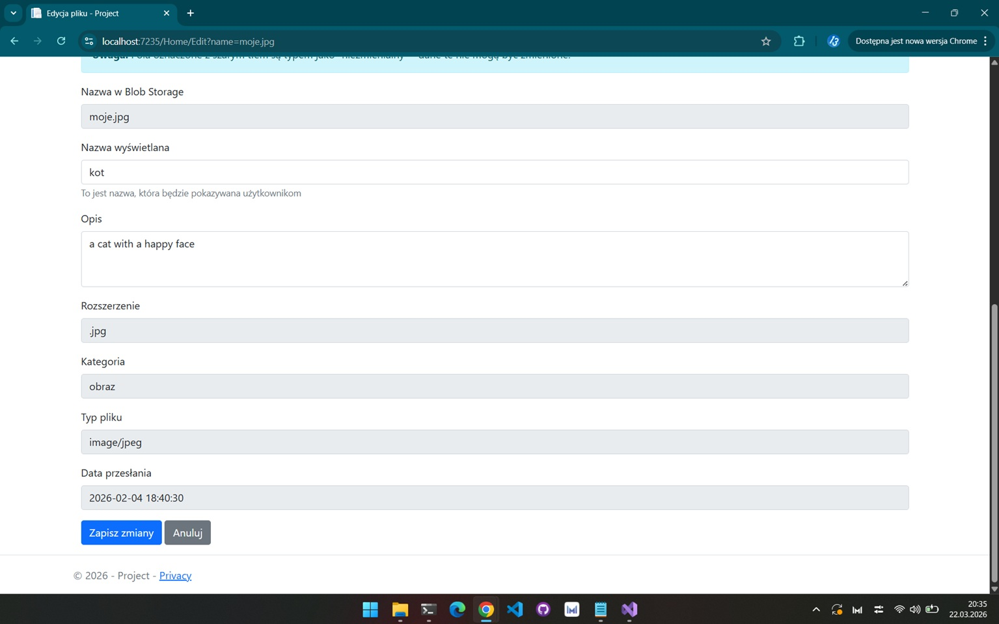

# Azure Smart File Describer

Azure Smart File Describer to aplikacja internetowa, która działa jako inteligentne rozwiązanie do przechowywania danych. Automatycznie generuje opisy dla przesłanych plików, ułatwiając zarządzanie i wyszukiwanie danych. Aplikacja wykorzystuje usługi Azure do przechowywania plików, analizowania ich zawartości i zapisywania metadanych dla szybkiego dostępu.

## Funkcje

- **Przesyłanie i przechowywanie plików**: Pliki są przesyłane i bezpiecznie przechowywane w Azure Blob Storage.
- **Automatyczne opisy plików**: Aplikacja wykorzystuje usługi Azure AI do analizy plików i generowania znaczących opisów.
- **Zarządzanie metadanymi**: Metadane plików, w tym opisy i odniesienia, są przechowywane w Azure Cosmos DB.
- **Przyjazny interfejs użytkownika**: Prosty i intuicyjny interfejs internetowy do zarządzania plikami i przeglądania ich opisów.

## Jak to działa

1. **Przesyłanie plików**: Użytkownik przesyła pliki za pomocą interfejsu internetowego.
2. **Przechowywanie w Azure Blob**: Pliki są przechowywane w Azure Blob Storage.
3. **Analiza AI**: Usługi Azure AI (np. Azure Computer Vision i Azure Document Intelligence) analizują pliki, aby wygenerować opisy.
4. **Przechowywanie metadanych**: Wygenerowane opisy i odniesienia do plików są zapisywane w Azure Cosmos DB.
5. **Zarządzanie plikami**: Użytkownicy mogą przeglądać i zarządzać swoimi plikami oraz opisami za pomocą interfejsu internetowego.

## Wykorzystane usługi Azure

- **Azure Blob Storage**: Do przechowywania przesłanych plików.
- **Azure Cosmos DB**: Do przechowywania metadanych i opisów plików.
- **Azure Computer Vision**: Do analizy obrazów i generowania opisów.
- **Azure Document Intelligence**: Do analizy dokumentów i wyodrębniania kluczowych informacji.


## Zrzuty ekranu

Poniżej znajdują się zrzuty ekranu aplikacji:

### Strona główna


### Przesyłanie plików


### Opisy plików


---

### Wymagania wstępne

- .NET 8.0 SDK
- Konto Azure z skonfigurowanymi usługami Blob Storage, Cosmos DB i AI

### Konfiguracja

1. Sklonuj repozytorium:
   ```bash
   git clone https://github.com/Kacper-Sz/Azure-Smart-File-Describer
   ```
2. Zaktualizuj plik `appsettings.json` swoimi danymi konfiguracyjnymi Azure.
3. Uruchom aplikację

### Wdrożenie

Aplikację można wdrożyć w Azure App Service lub na dowolnej innej platformie hostingowej obsługującej aplikacje .NET.
